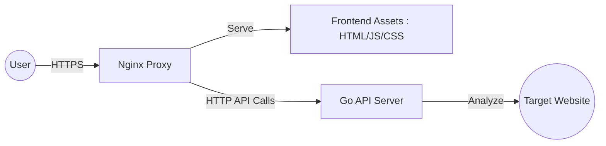

# Web Analyzer App

This web/api tool for analyzing the structure, metadata, and accessibility of web pages. It provides detailed insights into HTML versions, headings, link health, and login form detection.

## Project Overview

The Web Analyzer consists of a **Go-based REST API** and a **responsive web frontend**. It is designed to be easily deployable using Docker and includes built-in monitoring (Prometheus) and profiling (pprof) capabilities.

## Architecture

### High-Level Architecture

The system follows a decoupled client-server architecture where the frontend communicates with the backend through a reverse proxy. This ensures security, simplifies CORS management, and allows for seamless scaling of individual components.

