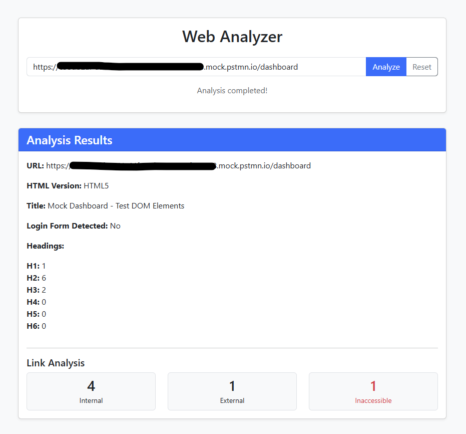

# Web Analyzer App


A web and API-based tool for analyzing the structure, metadata, accessibility, and link health of web pages. It provides detailed insights such as HTML version detection, heading hierarchy analysis, broken link detection, and login form identification.

## 1. System Architecture

The Web Analyzer is a production-ready, microservices-based application built with modern software engineering principles. It consists of:

1.  **Go-based REST API**: High-performance backend performing core web analysis and orchestrating concurrent workers.
2.  **Responsive Web Frontend**: User-friendly interface served via Nginx with environment-configurable API endpoints.
3.  **Dockerized Infrastructure**: Containerized architecture enabling consistent deployment across environments.

### Design Principles

The system architecture emphasizes:

- **Scalability**: Concurrent worker pool architecture enables horizontal scaling for handling multiple analysis requests simultaneously. The goroutine-based link checker can process hundreds of links in parallel.
- **Observability**: Comprehensive monitoring via Prometheus metrics and pprof profiling provides real-time insights into system performance, resource utilization, and bottlenecks.
- **Reliability**: Graceful shutdown mechanisms, context-based cancellation, and structured error handling ensure robust operation under various conditions.
- **Security**: API key authentication, CORS management via Nginx reverse proxy, and environment-based configuration protect against unauthorized access.
- **Maintainability**: Layered architecture with clear separation of concerns (handlers, services, repositories) makes the codebase easy to understand, test, and extend.
- **Performance**: Asynchronous processing with worker pools, in-memory storage for fast data access, and efficient HTML parsing optimize response times.

### Sample Analysis Output


---

## 2. Architecture Diagram

### High-Level Architecture

The frontend communicates with the backend API through an Nginx reverse proxy, simplifying CORS handling and enabling flexible deployments.


### Backend Architecture

The backend follows a layered architecture with a concurrent worker pool for analysis.


### Process Flow

The application follows an asynchronous analysis pattern with a polling-based communication mechanism between frontend and backend:

1. **URL Submission**: User enters a target URL in the frontend interface and then frontend initiates `POST /api/v1/web-analyzer/analyze`
2. **Analysis Initiation**: Backend validates the request, starts asynchronous background processing with worker pools and then returns unique `analyze_id` (Guid) immediately
3. **Polling Mechanism**: Frontend establishes a 3-second polling interval, repeatedly calling `GET /api/v1/web-analyzer/:analyze_id/analyze` to check analysis status
4. **Status Monitoring**: Backend returns current analysis state:
   - `pending`: Analysis still in progress (frontend continues polling)
   - `success`: Analysis completed successfully (polling stops)
   - `failed`: Analysis failed due to validation or processing errors (polling stops)
5. **Result Display**: 
   - **Success**: UI renders comprehensive analysis data including HTML metadata, heading hierarchy, link statistics, and accessibility issues
   - **Error/Validation Failure**: UI displays appropriate error messages with context for user correction

This asynchronous approach ensures the UI remains responsive during long-running analyses and allows the backend to efficiently process multiple requests concurrently.
> [!NOTE]
> API specification is available at section 7 [API Specification](#7-api-specification).

### Component Responsibilities

- **Gin Router**: Entry point for all API requests and handles routing.
- **Middleware**: Manages API key authentication, Prometheus metrics, pprof profiling, and CORS.
- **API Controllers / Handlers**: Validates requests, invokes service logic, and serializes responses.
- **Web Analyze Service**: Orchestrates the workflow, coordinating parsing, state management, and link checking.
- **Repository Layer**: Provides in-memory storage (proposing migrate to MongoDB/PostgreSQL).
- **HTML Helper**: Parses HTML using `golang.org/x/net/html` to extract metadata and forms.
- **Worker Pool**: Concurrently validates link accessibility and reports HTTP status codes.

---

## 3. Core Features

- **HTML Metadata**: Extraction of HTML version and page title.
- **Content Structure**: Detailed heading (H1–H6) hierarchy analysis.
- **Link Analysis**: Internal vs external link classification.
- **Health Checks**: Inaccessible link detection (4xx / 5xx) with status codes.
- **Login Form Detection**: Login form detection by checking for common login form elements.
- **Performance**: Asynchronous link checking using concurrent worker pools.
- **Observability**: Built-in metrics with Prometheus and profiling with pprof.
- **Deployment**: Docker-based setup with Nginx reverse proxy support.
- **Security**: API key authentication for API requests from the frontend/external apps.

---

## 4. Tech Stack

### Backend
- **Language**: [Go 1.23+](https://go.dev/)
- **Framework**: [Gin Gonic](https://gin-gonic.com/)
- **Monitoring**: [Prometheus](https://prometheus.io/)
- **Profiling**: [pprof](https://pkg.go.dev/net/http/pprof)
- **Parsing**: `golang.org/x/net/html`

### Frontend
- **Framework**: Vanilla JavaScript + jQuery
- **Styling**: Bootstrap 5
- **Web Server**: Nginx

---

## 5. Setup & Installation

### Option 1: Docker
```bash
git clone https://github.com/nadeeshandevon/web-analyzer-app.git
cd web-analyzer-app
docker-compose up --build -d
```
If required to redeploy the application, run the following command:
```bash
docker-compose down
docker-compose up --build -d
```

Access the app at: **[http://localhost:8080](http://localhost:8080)**

### Option 2: Local Development
**Run API:**
```bash
cd web-analyzer-api
go run app/cmd/main.go
```
**Run Frontend:**
Open `web-analyzer-web/index.html` in your browser. Ensure `app.js` is configured correctly for local API access as below.
```javascript
const API_BASE_URL = 'http://localhost:8081/api/v1/web-analyzer';
const API_KEY = 'dev-key-123';
```

---

## 6. Service Endpoint and Ports

| Service | URL |
| :--- | :--- |
| **Frontend** | [http://localhost:8080](http://localhost:8080) |
| **API Base** | [http://localhost:8081/api/v1](http://localhost:8081/api/v1) |
| **Prometheus Metrics** | [http://localhost:9090/metrics](http://localhost:9090/metrics) |
| **pprof Profiling** | [http://localhost:9090/debug/pprof/](http://localhost:9090/debug/pprof/) |

> [!NOTE]
> All API requests require an API key: `x-api-key: dev-key-123`.

---

## 7. API Specification

### 1. Start Web Analysis
Starts a background analysis for a given URL.

**Endpoint:** `POST /api/v1/web-analyzer/analyze`

**Request Body:**
```json
{
  "url": "https://www.test-app.com"
}
```

**Response:**
```json
{
  "analyze_id": "id-1735039290123"
}
```

### 2. Get Analysis Results
Retrieves analysis status and detailed results.

**Endpoint:** `GET /api/v1/web-analyzer/:analyze_id/analyze`

**Success Response:**
```json
{
  "url": "https://www.test-app.com",
  "html_version": "HTML5",
  "title": "Test App",
  "headings": { "h1": 1, "h2": 0 },
  "links": {
    "internal": 12,
    "external": 5,
    "inaccessible": 1,
    "inaccessible_details": [
      { "url": "https://invalid-link.com", "status_code": 404 }
    ]
  },
  "has_login_form": false,
  "status": "success",
  "error_description": ""
}
```

---

## 8. Observability

The application provides comprehensive observability through:

- **Prometheus Metrics**: Available at [http://localhost:9090/metrics](http://localhost:9090/metrics) for monitoring HTTP request metrics and Go process metrics.
- **pprof Profiling**: Available at [http://localhost:9090/debug/pprof/](http://localhost:9090/debug/pprof/) for CPU, memory, and goroutine profiling (can be enabled/disabled via `ENABLE_PPROF` environment variable).

---

## 9. Testing & Coverage

### Current Coverage Status
The overall statement coverage for the `app` package is currently **74.8%**.


#### Interactive Report
HTML coverage report is available: [coverage.html](coverage.html).

### How to Run Tests
```bash
cd web-analyzer-api
go test ./app/... -coverprofile=coverage.out
go tool cover -func=coverage.out
```

---

## 10. Challenges & Solutions

- **Container Networking**: Solved frontend-to-backend communication issues using an Nginx reverse proxy, enabling relative API paths and eliminating CORS issues.
- **Performance**: Implemented a goroutine-based worker pool to asynchronously validate links.

---

## 11. Future Improvements

- [ ] Persistent database storage (PostgreSQL/MongoDB).
- [ ] Advanced Prometheus metrics + Grafana dashboards and apply metric for background analysis.
- [ ] Frontend migration to React/Vue.
- [ ] JWT-based authentication.
- [ ] CI/CD continuous delivery pipeline.
- [ ] API Rate limiting.
- [ ] WebSocket-based real-time update the UI once the analysis is completed.
