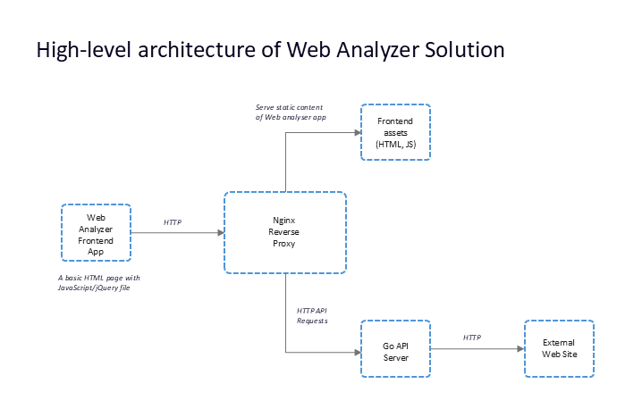
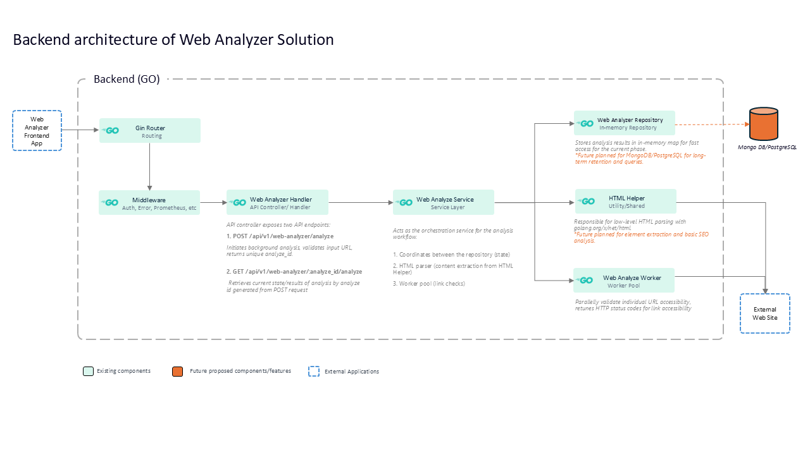
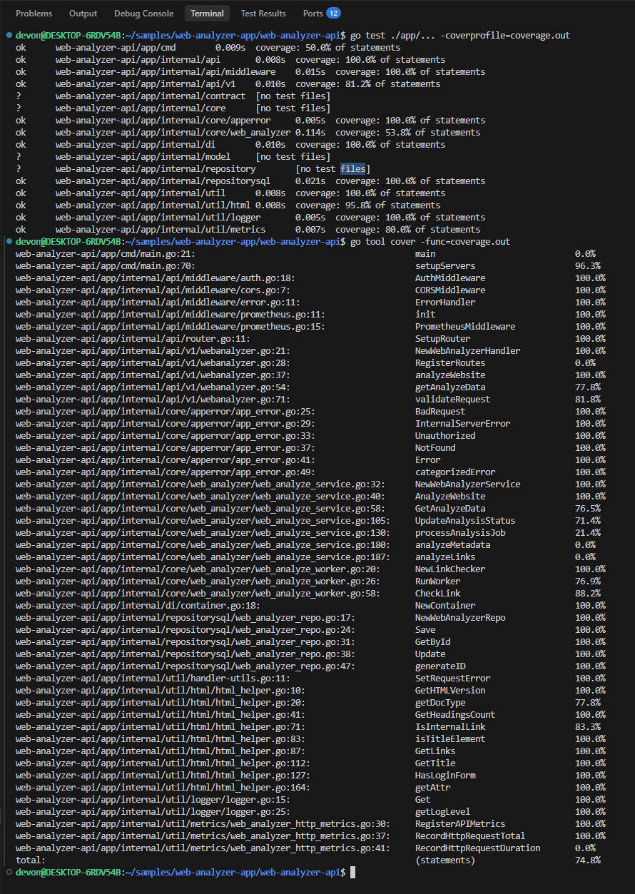

# Web Analyzer App


A web and API-based tool for analyzing the structure, metadata, accessibility, and link health of web pages. It provides detailed insights such as HTML version detection, heading hierarchy analysis, broken link detection, and login form identification.

## Features

- **HTML Metadata**: Extraction of HTML version and page title.
- **Content Structure**: Detailed heading (H1–H6) hierarchy analysis.
- **Link Analysis**: Internal vs external link classification.
- **Health Checks**: Inaccessible link detection (4xx / 5xx) with status codes.
- **Login Form Detection**: Login form detection by checking for common login form elements.
- **Performance**: Asynchronous link checking using concurrent worker pools.
- **Observability**: Built-in metrics with Prometheus and profiling with pprof.
- **Deployment**: Docker-based setup with Nginx reverse proxy support.
- **Security**: API key authentication for API requests from the frontend/external apps.

## Project Overview

The Web Analyzer consists of:
1.  **Go-based REST API**: Performs core analysis and orchestrates workers.
2.  **Responsive Web Frontend**: Served via Nginx for a clean user interface.
3.  **Dockerized Infrastructure**: Environment-agnostic deployment with monitoring.

The system is designed to be scalable, observable, and easy to deploy.

## Architecture

### High-Level Architecture

The frontend communicates with the backend API through an Nginx reverse proxy, simplifying CORS handling and enabling flexible deployments.



### Backend Architecture

The backend follows a layered architecture with a concurrent worker pool for analysis.



### Component Responsibilities

- **Gin Router**: Entry point for all API requests; handles routing.
- **Middleware**: Manages API key authentication, Prometheus metrics, pprof profiling, and CORS.
- **API Controllers / Handlers**: Validates requests, invokes service logic, and serializes responses.
- **Web Analyze Service**: Orchestrates the workflow, coordinating parsing, state management, and link checking.
- **Repository Layer**: Provides in-memory storage (proposing migrate to MongoDB/PostgreSQL).
- **HTML Helper**: Parses HTML using `golang.org/x/net/html` to extract metadata and forms.
- **Worker Pool**: Concurrently validates link accessibility and reports HTTP status codes.

## Key URLs

| Service | URL |
| :--- | :--- |
| **Frontend** | [http://localhost:8080](http://localhost:8080) |
| **API Base** | [http://localhost:8081/api/v1](http://localhost:8081/api/v1) |
| **Prometheus Metrics** | [http://localhost:9090/metrics](http://localhost:9090/metrics) |
| **pprof Profiling** | [http://localhost:9090/debug/pprof/](http://localhost:9090/debug/pprof/) |

> [!NOTE]
> All API requests require an API key: `x-api-key: dev-key-123`.

## API Reference

### 1. Start Web Analysis
Starts a background analysis for a given URL.

**Endpoint:** `POST /api/v1/web-analyzer/analyze`

**Request Body:**
```json
{
  "url": "https://www.test-app.com"
}
```

**Response:**
```json
{
  "analyze_id": "id-1735039290123"
}
```

### 2. Get Analysis Results
Retrieves analysis status and detailed results.

**Endpoint:** `GET /api/v1/web-analyzer/:analyze_id/analyze`

**Success Response:**
```json
{
  "url": "https://www.test-app.com",
  "html_version": "HTML5",
  "title": "Test App",
  "headings": { "h1": 1, "h2": 0 },
  "links": {
    "internal": 12,
    "external": 5,
    "inaccessible": 1,
    "inaccessible_details": [
      { "url": "https://invalid-link.com", "status_code": 404 }
    ]
  },
  "has_login_form": false,
  "status": "success",
  "error_description": ""
}
```

---

## Technology Stack

### Backend
- **Language**: [Go 1.23+](https://go.dev/)
- **Framework**: [Gin Gonic](https://gin-gonic.com/)
- **Monitoring**: [Prometheus](https://prometheus.io/)
- **Profiling**: [pprof](https://pkg.go.dev/net/http/pprof)
- **Parsing**: `golang.org/x/net/html`

### Frontend
- **Framework**: Vanilla JavaScript + jQuery
- **Styling**: Bootstrap 5
- **Web Server**: Nginx

---

## Setup & Installation

### Option 1: Docker
```bash
git clone https://github.com/nadeeshandevon/web-analyzer-app.git
cd web-analyzer-app
docker-compose up --build -d
```
If required to redeploy the application, run the following command:
```bash
docker-compose down
docker-compose up --build -d
```

Access the app at: **[http://localhost:8080](http://localhost:8080)**

### Option 2: Local Development
**Run API:**
```bash
cd web-analyzer-api
go run app/cmd/main.go
```
**Run Frontend:**
Open `web-analyzer-web/index.html` in your browser. Ensure `app.js` is configured correctly for local API access as below.
```javascript
const API_BASE_URL = 'http://localhost:8081/api/v1/web-analyzer';
const API_KEY = 'dev-key-123';
```
---

## Testing & Coverage

### Current Coverage Status
The overall statement coverage for the `app` package is currently **74.8%**.



#### Interactive Report
HTML coverage report is available: [coverage.html](coverage.html).

### How to Run Tests
```bash
cd web-analyzer-api
go test ./app/... -coverprofile=coverage.out
go tool cover -func=coverage.out
```

---

## Challenges & Solutions

- **Container Networking**: Solved frontend-to-backend communication issues using an Nginx reverse proxy, enabling relative API paths and eliminating CORS issues.
- **Performance**: Implemented a goroutine-based worker pool to asynchronously validate links.

## Possible Improvements

- [ ] Persistent database storage (PostgreSQL/MongoDB).
- [ ] Advanced Prometheus metrics + Grafana dashboards and apply metric.
- [ ] Frontend migration to React/Vue.
- [ ] JWT-based authentication.
- [ ] CI/CD continuous delivery pipeline.
- [ ] API Rate limiting.
- [ ] WebSocket-based real-time updates.