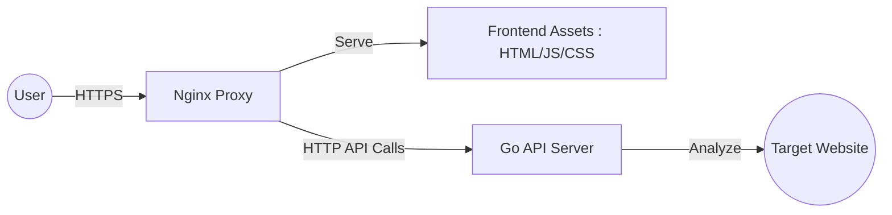
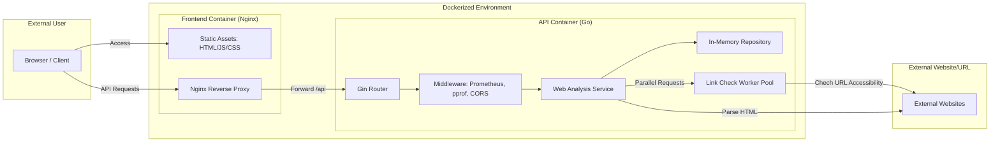
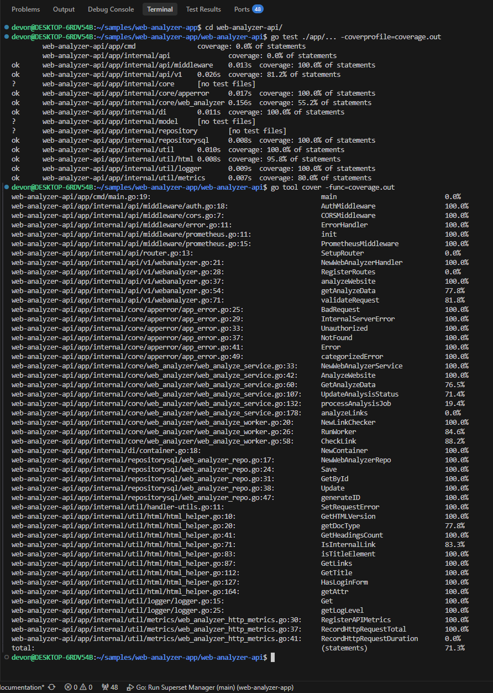

# Web Analyzer App

This web/api tool for analyzing the structure, metadata, and accessibility of web pages. It provides detailed insights into HTML versions, headings, link health, and login form detection.

## Project Overview

The Web Analyzer consists of a **Go-based REST API** and a **responsive web frontend**. It is designed to be easily deployable using Docker and includes built-in monitoring (Prometheus) and profiling (pprof) capabilities.

## Architecture

### High-Level Architecture

The system follows a decoupled client-server architecture where the frontend communicates with the backend through a reverse proxy. This ensures security, simplifies CORS management, and allows for seamless scaling of individual components.



### Process Flow

The following diagram illustrates the lifecycle of an analysis request, from the initial frontend submission to background processing.

- **Request Initiation**: The User submits a URL via the Frontend.
- **Proxying**: The Nginx Proxy forwards the API request to the Go Backend.
- **Job Creation**: The API validates the URL, creates a "pending" entry in the In-Memory Repository, and returns a unique `analyze_id`.
- **Parallel Analysis**: The Web Analysis Service fetches the target page and starts multiple workers to check link accessibility concurrently.
- **Data Aggregation**: Once all workers finish, the service updates the repository with the final analysis data (HTML version, headings, link counts, etc.).
- **Polling**: The Frontend periodically polls the API with the `analyze_id` until the analysis is complete (Status: `success` or `failed`).



### Key URLs
- **Frontend**: [http://localhost:8080](http://localhost:8080)
- **API Base URL**: [http://localhost:8081/api/v1](http://localhost:8081/api/v1)
- **Prometheus Metrics**: [http://localhost:8081/metrics](http://localhost:8081/metrics)
- **pprof Profiling**: [http://localhost:8081/debug/pprof/](http://localhost:8081/debug/pprof/)

## API Reference

The API uses a basic API key authentication. All requests must include the `x-api-key: dev-key-123` header.

### 1. Start Web Analysis
Initiates a new background analysis for a given URL.

- **Endpoint**: `POST /api/v1/web-analyzer/analyze`
- **Request Body**:
```json
{
  "url": "https://www.test-app.com"
}
```
- **Response** (200 OK):
```json
{
  "analyze_id": "id-1735039290123"
}
```

### 2. Get Analysis Results
Retrieves the current status and results of an analysis.

- **Endpoint**: `GET /api/v1/web-analyzer/:analyze_id/analyze`
- **Response** (200 OK - Successful Analysis):
```json
{
  "url": "https://www.test-app.com",
  "html_version": "HTML5",
  "title": "Test App",
  "headings": {
    "h1": 1,
    "h2": 0
  },
  "links": {
    "internal": 12,
    "external": 5,
    "inaccessible": 1,
    "inaccessible_details": [
      {
        "url": "https://invalid-link.com",
        "status_code": 404
      }
    ]
  },
  "has_login_form": false,
  "status": "success",
  "error_description": ""
}
```

- **Response** (200 OK - In Progress):
```json
{
  "status": "pending"
}
```


## Technology Stack

### Development Environment Setup Used
- **OS**: Ubuntu 24.04 (WSL2)
- **IDE**: Visual Studio Code
- **Version Control**: Git
- **GitHub**: [https://github.com/nadeeshandevon/web-analyzer-app](https://github.com/nadeeshandevon/web-analyzer-app)
- **Containerization**: Docker & Docker Compose
- **API Testing**: Postman Desktop Tool

### Backend (BE)
- **Language**: [Go 1.23+](https://go.dev/)
- **Web Framework**: [Gin Gonic](https://gin-gonic.com/)
- **Monitoring**: [Prometheus](https://prometheus.io/)
- **Profiling**: [pprof](https://pkg.go.dev/net/http/pprof)
- **HTML Parsing**: `golang.org/x/net/html`

#### Used Go Packages
- `github.com/gin-gonic/gin`: As the HTTP web framework.
- `github.com/gin-contrib/pprof`: As the middleware for serving `runtime/pprof` profiling data.
- `github.com/prometheus/client_golang`: As the Prometheus instrumentation library for Go.
- `github.com/google/uuid`: As the library for generating and inspecting UUIDs.
- `github.com/stretchr/testify`: As the testing toolkit with common assertions and mocks for testing.
- `golang.org/x/net/html`: As the HTML parser.

### Frontend (FE)
- **Framework**: [Vanilla JavaScript](https://developer.mozilla.org/en-US/docs/Web/JavaScript) with [jQuery](https://jquery.com/)
- **Styling**: [Bootstrap 5](https://getbootstrap.com/)
- **Web Server**: [Nginx](https://www.nginx.com/)

### DevOps & Infrastructure
- **Containerization**: [Docker](https://www.docker.com/) & [Docker Compose](https://docs.docker.com/compose/)
- **Security**: Basic API Key authentication via `x-api-key` header.

## Frontend Configuration

The frontend `app.js` needs to be configured based on your deployment method.

### Docker Deployment (Nginx Proxy)
When running within Docker, the application uses an Nginx reverse proxy. The `API_BASE_URL` should be a relative path:
```javascript
const API_BASE_URL = '/api/v1/web-analyzer';
```

### Local Development Setup
If you are running the Go API locally (usually on port 8081) and opening the `index.html` file directly or serving it from a different origin, you must use the full URL:
```javascript
const API_BASE_URL = 'http://localhost:8081/api/v1/web-analyzer';
```

**Security Note**: Ensure the `API_KEY` in `app.js` matches the `API_KEY` environment variable used by the backend. (Note: Currently, API_KEY is hardcoded to `dev-key-123` in both frontend and backend)

## Setup & Installation

### Option 1: Using Docker (Recommended)

1.  Clone the repository.
2.  Navigate to the project root.
3.  Run the following command:
    ```bash
    docker-compose up --build -d
    ```
4.  Access the application at [http://localhost:8080](http://localhost:8080).

### Option 2: Local Development

**Run the API:**
```bash
cd web-analyzer-api
go run app/cmd/main.go
```
*The API will be available at `http://localhost:8081`.*

**Run the Frontend:**
Open `web-analyzer-web/index.html` in a browser and ensure `app.js` is configured for local access as described above.

### Local API Testing Approach

For robust local testing and development, the API was verified using the **Postman Desktop Tool** to simulate various real-world scenarios without relying on live external websites.

1.  **Mock HTML Application**: A mock environment was created using Postman to return specific HTML structures. This allowed for test different use cases:
    *   HTML versions.
    *   Heading hierarchies.
    *   Link structures (internal and external).
    *   Presence of `<form type="password">` elements for login detection.

### Unit Test Coverage

The backend API is equipped with a comprehensive suite of unit tests to ensure reliability and maintainability. We prioritize high coverage for core business logic, middleware, and utility functions.

#### Current Coverage Status
The overall statement coverage for the `app` package is currently **71.3%**.


#### How to Run Tests
To execute the tests and generate a coverage report, run the following commands in the `web-analyzer-app` root directory:

```bash
# Change directory to the API directory
cd web-analyzer-api/

# Run all tests and generate a coverage profile
go test ./app/... -coverprofile=coverage.out

# View the coverage summary in terminal
go tool cover -func=coverage.out
```

#### Viewing Detailed Coverage
To see a line-by-line coverage report in browser:
```bash
go tool cover -html=coverage.out
```


## Main Functionalities

### 1. Web Analysis
- **Metadata**: Extracts HTML version and Page Title.
- **Headings**: Counts occurrences of H1 through H6 tags.
- **Link Analysis**:
    - Different bucket for Internal and External links.
    - Checks for "Inaccessible" links whichever returns 4xx/5xx status codes.
- **Security Check**: Detection of Login Forms.

### 2. DevOps & Observability
- **Authentication**: `AuthMiddleware` verifies requests using the `x-api-key` header.
- **Logging**: Structured logging using a custom `slog` wrapper.
- **Graceful Shutdown**: The API handles termination signals gracefully.
- **Metrics**: High-level HTTP request metrics exported for Prometheus.

## Challenges & Approaches

- **Docker Networking & Portability**: Initially, the frontend was hardcoded to `localhost`. But solved this by implementing an Nginx reverse proxy inside the frontend container and using relative paths in JavaScript.
- **Asynchronous Processing**: Checking hundreds of links on a page is slow. So, implemented a worker pool using Go channels and goroutines to perform link health checks in parallel.

## Possible Improvements

- **Database Persistence**: Currently, analysis results are stored in an in-memory map. We can use a database (MongoDB or Postgres) to store the results.
- **Enhanced Analysis**: Add more prometheus metrics to monitor worker jobs.
- **Advanced Frontend**: Migrate to a framework like React or Vue with proper JS minification and bundling.
- **Authentication**: Upgrade to JWT-based authentication for user-specific data.
- **Unit Tests**: Add more unit tests to cover edge cases and increase code coverage.
- **CI/CD**: Add CI/CD pipeline to automate the build and deployment process.
- **Rate Limiting**: Add rate limiting middleware to prevent abuse the external APIs.


